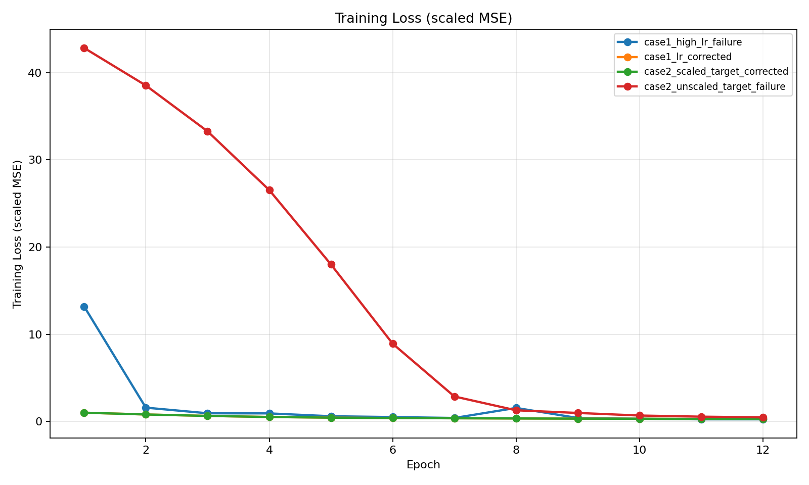
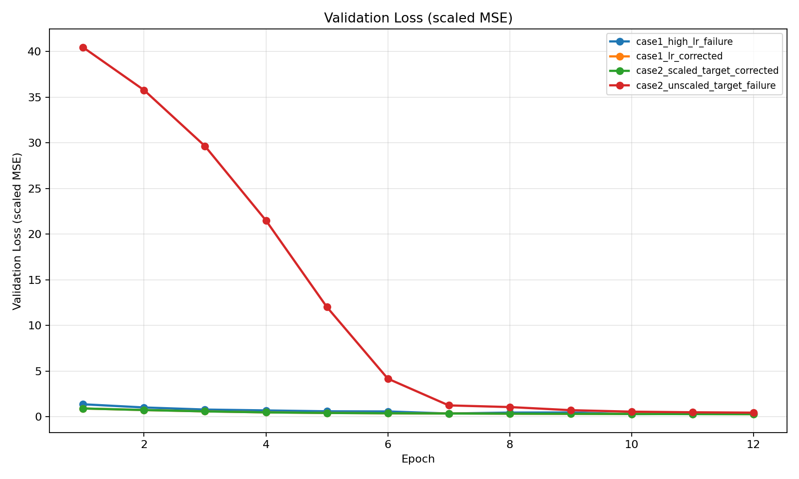
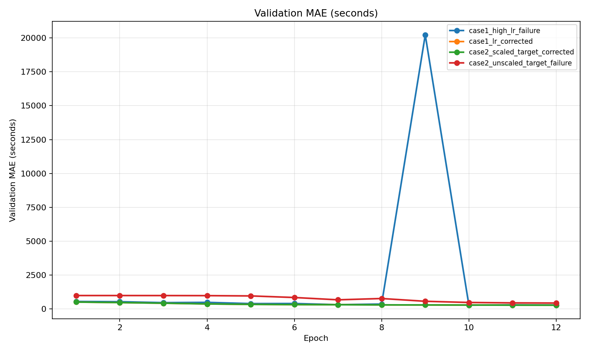

# CS 6320 — Assignment 4

**Name:** Brandon Jackson  
**Semester:** Summer 2026  
**Course:** Deep Learning (CS 6320)

---

## Part A — Training failure and debugging report (NYC TLC)

### Task and setup

**Dataset:** Week 4 prepared NYC Yellow Taxi trip-duration Parquet (`week04_tlc_trip_duration_smoke_10k.parquet` locally; full file on CHPC).

**Prediction task:** Regress `target_log_duration` (`log1p` of trip seconds). Report **validation MAE in seconds** after `expm1`.

**Features:** `pickup_location_id`, `dropoff_location_id`, `pickup_hour`, `pickup_day_of_week` (embeddings); `pickup_day_of_month`, `trip_distance`, `passenger_count` (standardized numeric).

**Split:** Prepared temporal `split` column (`train` 70% / `validation` 15% / `test` 15%) — no random re-split.

**Model:** Small MLP with categorical embeddings (64 hidden units), Adam optimizer, mini-batches of 512.

**Seed:** `6320` (fixed across cases).

**Implementation:** `scripts/train_debugging_experiments.py`, adapted from Assignment 3’s visible loop (forward → loss → backward → step → validation each epoch).

### Required learning-curve plots

*Figures 1–3: Learning curves generated from `outputs/*_history.csv` via `scripts/plot_learning_curves.py`.*

### Summary table (epoch 12, smoke 10k, CPU)

| Experiment | Controlled change | Final val MSE | Final val MAE (s) | Notes |
| --- | --- | ---: | ---: | --- |
| `case1_high_lr_failure` | `lr = 0.2` | 0.324 | **282.7** | Unstable; epoch-9 MAE spike |
| `case1_lr_corrected` | `lr = 0.001` | 0.295 | **272.9** | Smooth improvement |
| `case2_unscaled_target_failure` | no target scaling | 0.458 | **430.6** | Slow, poor seconds MAE |
| `case2_scaled_target_corrected` | standardized log target | 0.295 | **272.9** | Matches stable training |

---

### Failure case 1 — learning rate too high

| Report field | Content |
| --- | --- |
| **Failure signal** | Validation MAE became unstable and spiked to **20,226 s** at epoch 9; training loss oscillated (e.g., 0.40 → **1.55** → 0.40 between epochs 7–8). |
| **Before evidence** | `case1_high_lr_failure_history.csv`; Figure 3 shows the MAE spike; Figure 1 shows non-monotonic training loss. |
| **Hypothesis** | Adam step size was too large for the scaled MSE objective and embedding+MLP landscape, causing overshoot and unstable updates. |
| **Controlled change** | Reduce learning rate from **0.2 → 0.001** only; hold model, batch size, scaling, and seed fixed. |
| **After evidence** | `case1_lr_corrected_history.csv`; validation MAE improved steadily **503 → 273 s** with no spikes (Figure 3). |
| **Limitation** | High learning rate still partially converged by epoch 12 on the smoke subset; instability—not total divergence—was the diagnosable failure mode. |

**What I learned:** A single hyperparameter can produce misleading “okay” aggregate metrics while hiding catastrophic single-epoch validation behavior. Learning-curve plots exposed a spike that a final-epoch table alone would understate.

---

### Failure case 2 — target not standardized

| Report field | Content |
| --- | --- |
| **Failure signal** | Training on **raw log-duration** targets produced misleadingly slow loss descent and **poor final validation MAE (430.6 s)** despite falling MSE. |
| **Before evidence** | `case2_unscaled_target_failure_history.csv`; Figure 2 shows higher validation loss plateaus; Figure 3 shows MAE stuck well above the corrected run. |
| **Hypothesis** | Without standardizing the regression target, gradient magnitudes were poorly matched to the scaled numeric inputs and embedding outputs (same issue family as Assignment 3’s raw-seconds training). |
| **Controlled change** | Standardize `target_log_duration` using **train mean/std** before MSE; convert back for seconds MAE reporting. |
| **After evidence** | `case2_scaled_target_corrected_history.csv`; validation MAE improved **503 → 273 s** across 12 epochs (Figure 3). |
| **Limitation** | Smoke 10k subset only; CHPC full-data run pending for stronger evidence. |

**What I learned:** Preprocessing is part of training stability. A descending loss on the wrong target scale can look like progress while seconds MAE remains practically poor.

---

### Run evidence (local)

- Command: `bash run_smoke_test.sh`
- Log: `logs/run_smoke.log`
- Artifacts: `outputs/*_history.csv`, `outputs/*_summary.json`, `outputs/plots/*.png`, `outputs/experiment_manifest.json`

### CHPC (pending)

Submit on Granite with `sbatch run_week04_smoke_test.slurm` (smoke) or `sbatch run_week04_tlc_debugging.slurm` (full Parquet). Save `logs/slurm-*.out` / `.err` after the job completes.

---

## Part B — Locked portfolio project charter (Board Game Geek)

### Portfolio problem statement

Help a hobby retailer estimate whether a **new or upcoming board game** is likely to reach a practical **BoardGameGeek average rating ≥ 7.0** using only **pre-rating design metadata**, so stocking decisions can be made before stable community scores exist.

### Intended stakeholder / use case

**Stakeholder:** hobby retailer or buyer curating inventory for BGG-aware customers.

**Decision:** preorder / initial stock vs pass — based on predicted eventual community reception, not same-day ratings.

**Prediction moment:** at or near publication, before sufficient BGG votes accumulate.

### Dataset source, access, and licensing

| Item | Lock |
| --- | --- |
| Source | Kaggle *Board Games Database from BoardGameGeek* (`threnjen/board-games-database-from-boardgamegeek`) |
| Unit | One row per game (~21,925 in Assignment 2 scan) |
| Access | Kaggle API token verified in Assignment 2 (`games.csv` downloads and parses) |
| License / use | Course and research use under Kaggle terms; not commercial BGG API replacement |
| Constraints | No live scraping; document voter-selection bias and Kaggle snapshot date |

### Prediction target

- **Target:** `high_rating = 1` if `AvgRating >= 7.0`, else `0`
- **Balance:** ~26.9% positive (5,895 games) — imbalanced but workable
- **Label timing:** historical final ratings for training; eventual rating for intended deployment narrative

### Candidate input features

**Include (v1):** `YearPublished`, `MinPlayers`, `MaxPlayers`, manufacturer/community playtime fields, age recommendations, encoded **mechanics** and **categories** (after join deduplication).

**Exclude (leakage / identity):** `AvgRating`, `BayesAvgRating`, `StdDev`, `GameWeight`, `NumRatings`, `UsersRated`, `RatingRank`, `NumOwned`, `NumWant`, `NumWish`, and similar popularity fields.

**Exclude (v1 text):** raw `Name` and `Description` — titles carry franchise/IP recognition; descriptions carry marketing and post-hoc reputation cues. Revisit only as controlled extensions (e.g., explicit franchise flags, cleaned text features) after tabular baselines.

### Prediction-time availability and leakage risks

| Risk | Consequence | Mitigation |
| --- | --- | --- |
| Rating-derived columns in *X* | Trivial accuracy inflation | Hard exclude list in prep script |
| Popularity counts in *X* | Leak post-release demand | Exclude `NumOwned`, etc. |
| Title memorization | Famous names bypass design signal | Exclude raw `Name` in v1 |
| Mechanics join duplication | Inflated feature rows | One-hot with dedupe rules |
| Train/test franchise leakage | Optimistic metrics | Hold out by game; consider publisher/franchise groups |

### Data quality, missingness, imbalance, representativeness

| Concern | Evidence / plan |
| --- | --- |
| Missingness | ~40 metadata columns ≥50% non-missing (A2 scan); document per-column rates in prep manifest |
| Imbalance | ~27% positive — report precision/recall/F1, not accuracy alone |
| Representativeness | BGG voters are self-selected enthusiasts; model describes BGG reception, not universal appeal |
| Snapshot bias | Kaggle mirror is static; newer releases may be underrepresented |

### Responsible-use limitations

- Outputs are **inventory screening aids**, not individual purchase advice.
- Ratings reflect community taste, not objective quality.
- Small publishers and non-English titles may be underrepresented.
- Human review required for high-stakes stocking decisions.

### Baseline model plan

1. **Majority-class / prevalence baseline**
2. **Logistic regression** on encoded tabular features
3. **Gradient-boosted trees** (primary classical comparator)

Neural model only if classical baselines plateau on held-out games.

### Initial model candidate

**Gradient-boosted trees** on encoded mechanics/categories and numeric metadata — strong default for heterogeneous tabular data with imbalance.

### Evaluation metrics and split strategy

| Metric | Why |
| --- | --- |
| **Precision / recall / F1** on `high_rating` | Imbalanced binary task |
| **ROC-AUC** | Threshold-independent ranking quality |
| **Confusion-matrix costs** | False “stock” vs false “skip” for retailer story |

**Split:** hold-out by game (stratified if possible); consider time-based slice by `YearPublished` for “new game” realism checks in later weeks.

### Scope limits

| In scope | Out of scope (v1) |
| --- | --- |
| Tabular metadata + mechanics/categories | Raw title/description embeddings |
| Binary ≥ 7.0 rating bar | Complexity/weight as primary target |
| Classical + optional small NN comparison | Production store API integration |
| Error analysis by publisher/year slices | Individual consumer recommender app |

### Success criteria (course project)

| Criterion | Success looks like |
| --- | --- |
| Clean prep with documented leakage exclusions | Reproducible manifest + feature list |
| Classical baseline beats majority class meaningfully | F1 / ROC-AUC clearly above trivial floor |
| Honest evaluation on held-out games | No franchise leakage in split |
| Clear stakeholder recommendation | Evidence-limited “stock / skip / review” framing |
| Responsible-use documented | No overclaim of universal quality |

**Not required:** beating state-of-the-art BGG prediction; deployment-ready system.

### Fallback plan

**College Scorecard** (institution debt-to-earnings burden) remains feasible (Assignment 2 scan) if BGG signal is too weak after leakage cleanup or joins stall. Fallback still answers a stakeholder screening question honestly.

**In-project fallback:** narrow to “recent releases only” or binary target tweak only with instructor approval; simplify to logistic regression if tree pipelines over-run scope.

### Staged model-improvement plan (remaining assignments)

| Stage | Plan | Evidence to collect |
| --- | --- | --- |
| **Baseline** | Majority + logistic regression | F1, ROC-AUC, confusion matrix |
| **Initial candidate** | Gradient-boosted trees on tabular features | Compare to logistic; slice by year/publisher |
| **Revised / alternative** | Small neural net **or** simpler logistic if trees suffice | Show whether added complexity earns lift |
| **Final recommendation** | Pick model by evidence-limited stakeholder criterion | What error type matters more for retailer |

This week’s TLC debugging exercises do **not** count as the portfolio model — they inform training discipline only.

### Evidence plan for final presentation

- Dataset audit table (below) and prep manifest
- Baseline vs candidate metrics on held-out games
- Slice analysis (imbalance, year cohort, publisher size)
- Leakage checklist signed off in prep
- Explicit limitations and responsible-use statement
- One clear recommendation: when to trust / not trust model output for stocking

### Completed portfolio dataset audit

| Audit category | Entry | Week 5+ follow-up |
| --- | --- | --- |
| **Source / use** | Kaggle BGG mirror; course/research use under Kaggle terms; not commercial API | Confirm snapshot date in manifest |
| **Target / input timing** | Predict eventual ≥7.0 from pre-rating metadata; exclude all post-rating fields | Time-split evaluation for “new release” slice |
| **Missingness** | ~40 columns ≥50% non-missing; mechanics join TBD | Per-column missing report in prep |
| **Imbalance** | ~27% positive | Report recall/F1; tune threshold for retailer costs |
| **Representativeness** | BGG enthusiast voters; English/market bias | Slice metrics by publisher size / year |
| **Leakage** | Rating + popularity + raw title excluded v1 | Automated leak column check in prep script |
| **Responsible use** | Screening aid only; human review required | Document in final memo |

Direction unchanged from Assignment 3; no dataset pivot required.

---

## AI disclosure

* **Tool(s) Used:** Cursor (Composer)
* **Extent of Use:** Repo scaffolding, experiment driver, Slurm/README templates from Week 4 student package and prior hw2/hw3 patterns; draft writeup prose from Assignment 3 charter context.
* **Human Contribution:** Selected failure/correction pairs, verified local experiment outputs and plots, will verify CHPC logs before final submission packaging.

**Certification:** I certify that all work not explicitly mentioned above is my own original work and I have verified all AI-generated content for accuracy.
